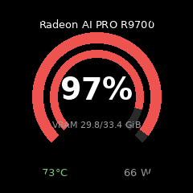
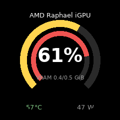
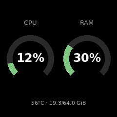
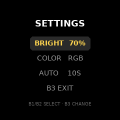

# ESP32 + GC9A01 display

A 240x240 circular IPS panel (GC9A01, SPI) driven by an ESP32, showing
each GPU's utilisation and VRAM as concentric dials, plus a CPU/RAM page.
Buttons switch pages and change display settings. resmon-lite sends one
JSON object per poll (UDP, or serial at 115200 baud); the firmware keeps
the latest reading and shows a "LINK LOST" page if nothing arrives for
10 s.

Display mockups (240x240 PNGs):

| GPU page | GPU page (idle) | CPU/RAM page | Settings | Link lost |
|---|---|---|---|---|
|  |  |  |  |  |

## Parts

- ESP32 (classic `esp32dev`; an ESP32-S3 works too — see USB notes below)
- GC9A01 240x240 circular IPS panel (SPI interface)
- 3 buttons (or 2 — see `TWO_BUTTONS` below)

## Wiring

All pins are in `src/config.h` — adjust that file to match your wiring.

| Function | Pin | Notes |
|---|---|---|
| MOSI | 23 | data out |
| SCK | 18 | clock |
| CS | 5 | chip select |
| DC | 17 | data/command |
| RST | 16 | reset |
| BL | 4 | backlight, 5 kHz PWM |
| B1 | 34 | next |
| B2 | 35 | previous |
| B3 | 39 | settings / exit |

Buttons are active-low: wire each between its pin and GND, with a 10 kΩ
pull-up to 3V3.

## Buttons

| Button | Main mode | Settings mode |
|---|---|---|
| B1 short | next page | move selection |
| B2 short | previous page | move selection |
| B3 short | open settings | change selected value |
| B3 long | — | exit settings |

Only two buttons? Set `TWO_BUTTONS 1` in `src/config.h`: B1 = next /
change, B2 short = previous / move selection, B2 long = open settings /
exit.

## Wi-Fi

Fill in `WIFI_SSID` and `WIFI_PASS` in `src/config.h` before flashing.
The board advertises the mDNS name `resmon.local` — point the host's
`remote_host` at it (or at the board's IP).

## Build & flash

```sh
cd esp32
pio run -t upload    # PlatformIO (pip install platformio)
```

Or the Arduino IDE with the `LovyanGFX` and `ArduinoJson` libraries
installed.

### USB

- **Classic ESP32**: any USB-serial bridge works; the port shows up as
  `/dev/ttyUSB0` (set `remote_usb_device` in the host config to match).
- **ESP32-S3**: native USB CDC — change `board` in `platformio.ini` to
  `esp32s3` (the port then shows up as `/dev/ttyACM0`).

## Settings

Display settings — backlight, colour mode (RGB/white/green),
auto-advance (off/5 s/10 s/30 s) — are changed on the display and stored
in ESP32 NVS, so they persist across power cycles. Host settings
(thresholds, poll interval) are not changed from the display.
